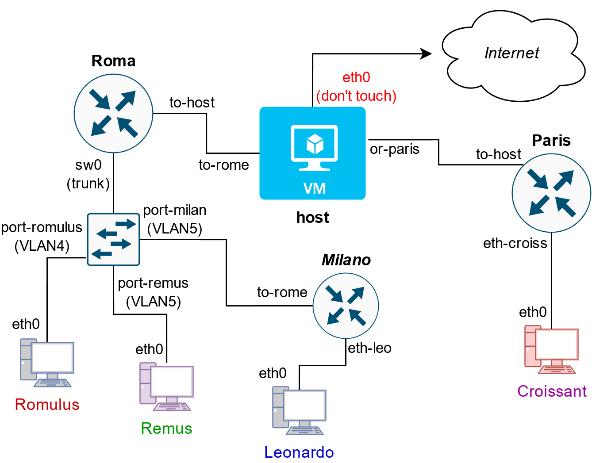

# Rezolvare Tema 2 Retele Locale


*Cuprins*:
- [Rezolvare Tema 2 Retele Locale](#rezolvare-tema-2-retele-locale)
  - [Topologie](#topologie)
  - [Conectarre prin SSH](#conectarre-prin-ssh)
  - [Asignment](#asignment)
  - [Conectarea prin echipamente](#conectarea-prin-echipamente)
  - [Task](#task)
    - [Task1](#task1)
      - [Task 1.1 | Subnetare FIXA](#task-11--subnetare-fixa)
      - [Task 1.2 | Subnetarea VARIABILA (VLSM)](#task-12--subnetarea-variabila-vlsm)
    - [Task 1.3 | Rutare](#task-13--rutare)
    - [Task 1.3 | Persistenta la restart](#task-13--persistenta-la-restart)
      - [Task 1.3 | Rutare | Default Gateways](#task-13--rutare--default-gateways)
      - [Task 1.3 | Rutare | Rute Statice](#task-13--rutare--rute-statice)
    - [Task 2 | Subnetare IPv6](#task-2--subnetare-ipv6)
    - [Task 3 | Accessing Hosts](#task-3--accessing-hosts)
      - [Task 3 | Accessing Hosts | **host** (router)](#task-3--accessing-hosts--host-router)
      - [Task 3 | Accessing Hosts | **Remus** (end-device)](#task-3--accessing-hosts--remus-end-device)
      - [Task 3 | Accessing Hosts | **Leonardo** (end-device)](#task-3--accessing-hosts--leonardo-end-device)
      - [Task 3 | Accessing Hosts | **Croissant** (end-device)](#task-3--accessing-hosts--croissant-end-device)
      - [Task 3 | Accesing Hosts | **Roma** (router)](#task-3--accesing-hosts--roma-router)
      - [Task 3 | Accesing Hosts | **Milano** (router)](#task-3--accesing-hosts--milano-router)
      - [Task 3 | Accesing Hosts | **Paris** (router)](#task-3--accesing-hosts--paris-router)

```
t2start bogdan.trifan2412
```


```
ip route add <adresa_retea>/<masca_subretea> via <gateway>
```

## Topologie


<br>

<br>

Rutere:
- host
- Roma
- Milano
- Paris

Contine un singur switch (denumit **sw0**), cu doua VLAN-uri: VLAN4 si VLAN5.

End-device-uri:
- Romulus
- Remus
- Leonardo
- Croissant


Conexiuni:
- host/eth0 <-> Internet (**DON'T TOUCH**)
- host/to-rome <-> Roma/to-host
- host/or-paris <-> Paris/to-host
- Roma <-> sw0 (trunk)
- sw0/port-romulus <-> Romulus/eth0 (VLAN4)
- sw0/port-remus <-> Remus/eth0 (VLAN5)
- sw0/port-milan <-> Milano/to-rome (VLAN5)
- Milano/eth-leo <-> Lenoardo/eth0
- Paris/eth-croiss <-> Croissant/eth0


## Conectarre prin SSH

```sh
eu@localhost$ ssh -J bogdan.trifan2412@fep.grid.pub.ro student@10.9.2.246
```


sau, in `~/.bashrc`:
```sh
ssh_open_stack () 
{ 
    if [[ $# != 1 ]]; then
        echo "[ERROR] Expected a single argument: the IP address of the OpenStack VM!";
        return;
    fi;
    IP=$1;
    ssh -J bogdan.trifan2412@fep.grid.pub.ro student@"$IP"
}
```

```sh
eu@localhost$ ssh_open_stack 10.9.2.246
```


Sau
```sh
cat ~/.ssh/config
# RL Tema 2
# ssh -J bogdan.trifan2412@fep.grid.pub.ro student@10.9.2.246
Host rl_tema_2
	User student
	HostName 10.9.2.246
	ProxyJump bogdan.trifan2412@fep.grid.pub.ro 
```


```sh
$ ssh rl_tema_2
```


## Asignment

> Moodle Username: `bogdan.trifan2412`


```sh
root@host:/home/student# cat /root/assignment.txt 
USERNAME=bogdan.trifan2412
A=179
B=7
C=106
D=171
E=158
F=73
G=13
H=27
I=46
J=214
K=80
```


## Conectarea prin echipamente


```sh
root@host:/home/student# docker ps | awk '{ print $NF }'
NAMES
mn.Croissant
mn.Leonardo
mn.Remus
mn.Romulus
mn.Paris
mn.Milano
mn.Switch0
mn.Roma
root@host:/home/student# docker ps | awk 'NR>1 { print $NF }' | sed "s/mn.//g"
Croissant
Leonardo
Remus
Romulus
Paris
Milano
Switch0
Roma
```


```sh
root@host: go Croissant
```


```sh
root@host: go Leonardo
```

```sh
root@host: go Remus
```

```sh
root@host: go Romulus
```

```sh
root@host: go Paris
```

```sh
root@host: go Milano
```

```sh
root@host: go Switch0
```

```sh
root@host: go Roma
```


## Task


### Task1


#### Task 1.1 | Subnetare FIXA

1. Subnetați FIX (i.e., dimensiuni egale, maximizare nr. de stații) spațiul 10.$A.$B.0/24 și configurați cu adrese IPv4 toate legăturile din topologie în ordinea cerută (începând cu PRIMA adresă asignabilă), astfel:
- prima subrețea alocată va fi VLAN4, asignare în ordinea: Roma, Romulus;
- a doua subrețea alocată va fi VLAN5, asignare în ordinea: Roma, Milano, Remus;
- a treia subrețea alocată va fi cea dintre Milano și Leonardo (asignare în această ordine);
- a patra subrețea alocată va fi cea dintre Paris și Croissant (la fel, în această ordine);


**Solutie**:
```
IP = 10.$A.$B.0/24
A = 179
B = 7
----

IP = 10.179.7.0/24
adresa IP este adresa de retea (/24 acopera in intregime primii 3 octeti)


Reteaua 1 (VLAN 4): Roma, Romulus
Reteaua 2 (VLAN 5): Roma, Milano, Remus
Reteaua 3: Milano, Leonardo
Reteaua 4: Paris, Croissant

Avem 4 subretele (4 <= 2^2) -> avem nevoie de 2 biti de subretea
/(24+2) = /26

Noile adrese vor avea (TOATE) mastile de /26.

O masca de /26 ofera 2^(32-26)=2^6=64 de host-uri (in total, atat asignabile, cat si neasignabile)


Format: `Retea: prima adresa IP -> ultima adresa IP`

R1: 10.179.7.0/26 -> +2^(32-26)-1 = +63 -> 10.179.7.63/26
R2: 10.179.7.64/26 -> +63 -> 10.179.6.127/26
R3: 10.179.7.128/26 -> +63 -> 10.179.7.191/26
R4: 10.179.7.192/26 -> +63 -> 10.179.7.255/26


R1-Roma-sw04: R/26
R1-Romulus: 10.179.7.2/26

R2-Roma: 10.175.7.65/26
R2-Milano: 10.179.7.66/26
R2-Remus: 10.179.7.67/26
R3-Milano: 10.179.7.129/26
R3-Leonardo: 10.179.7.130/26

R4-Paris: 10.179.7.193/26
R4-Croissant: 10.179.7.194/26
```

Rezultat:
- Reteaua 1 (VLAN 4):
    - R1-Roma-sw04: 10.179.7.1/26
    - R1-Romulus: 10.179.7.2/26
- Reteaua 2 (VLAN 5):
    - R2-Roma: 10.179.7.65/26
    - R2-Milano: 10.179.7.66/26
    - R2-Remus: 10.179.7.67/26
- Reteaua 3:
    - R3-Milano: 10.179.7.129/26
    - R3-Leonardo: 10.179.7.130/26
- Reteaua 4:
    - R4-Paris: 10.179.7.193/26
    - R4-Croissant: 10.179.7.194/26


In `~/.bashrc` de pe `host`:

```sh
export IP_R1_Roma_sw04="10.179.7.1/26"
export IP_R1_Romulus="10.179.7.2/26"

export IP_R2_Roma_sw05="10.179.7.65/26"
export IP_R2_Milano_to_rome="10.179.7.66/26"
export IP_R2_Remus="10.179.7.67/26"

export IP_R3_Milano_eth_leo="10.179.7.129/26"
export IP_R3_Leonardo="10.179.7.130/26"

export IP_R4_Paris_eth_croiss="10.179.7.193/26"
export IP_R4_Croissant="10.179.7.194/26"
```


```sh
# Pentru Reteaua 1 (VLAN 4)
root@Roma:~# ip addr add $IP_R1_Roma_sw04 dev sw0.4
root@Romulus:~# ip addr add $IP_R1_Romulus dev eth0

# Pentru Reteaua 2 (VLAN 5)
root@Roma:~# ip addr add $IP_R2_Roma_sw05 dev sw0.5
root@Milano:~# ip addr add $IP_R2_Milano_to_rome dev to-rome
root@Remus:~# ip addr add $IP_R2_Remus dev eth0

# Pentru Reteaua 3
root@Milano:~# ip addr add $IP_R3_Milano_eth_leo dev eth-leo
root@Leonardo:~# ip addr add $IP_R3_Leonardo dev eth0

# Pentru Reteaua 4
# Pe host-ul Paris:
root@Paris:~# ip addr add $IP_R4_Paris_eth_croiss dev eth-croiss
root@Croissant:~# ip addr add $IP_R4_Croissant dev eth0
```


Adica:

```sh
# Pentru Reteaua 1 (VLAN 4)
root@Roma:~# ip addr add 10.179.7.1/26 dev sw0.4
root@Romulus:~# ip addr add 10.179.7.2/26 dev eth0

# Pentru Reteaua 2 (VLAN 5)
root@Roma:~# ip addr add 10.179.7.65/26 dev sw0.5
root@Milano:~# ip addr add 10.179.7.66/26 dev to-rome
root@Remus:~# ip addr add 10.179.7.67/26 dev eth0

# Pentru Reteaua 3
root@Milano:~# ip addr add 10.179.7.129/26 dev eth-leo
root@Leonardo:~# ip addr add 10.179.7.130/26 dev eth0

# Pentru Reteaua 4
root@Paris:~# ip addr add 10.179.7.193/26 dev eth-croiss
root@Croissant:~# ip addr add 10.179.7.194/26 dev eth0
```


#### Task 1.2 | Subnetarea VARIABILA (VLSM)

2. Subnetați OPTIM spațiul 172.30.$C.240/28 + configurați echipamentele (host va avea mereu prima adresă asignabilă) astfel:
- o rețea între host și Roma;
- cealaltă (ultima rămasă): host și Paris.


**Solutie**:
```
IP = 172.30.$C.240/28
C = 126
----


IP = 172.30.106.240/28
adresa IP este adresa de retea

R5: 2H (Host si Roma) + 2H (IP retea si broadcast) = 4H <= 2^2 -> avem nevoie de 2 biti de host -> /(32-2) = /30
R6: 2H (Host si Paris) + 2H (IP retea si broadcast) = 4H <= 2^2 -> avem nevoie de 2 biti de host -> /(32-2) = /30

R5: /30 -> 2^(32-30) = 2^2 = 4 adrese IP (in total, atat asignabile, cat si neasignabile) 
R6: /30 -> 2^(32-30) = 2^2 = 4 adrese IP (in total, atat asignabile, cat si neasignabile) 


R5: 172.30.106.240/30 -> +2^(32-30)-1 = +3 > 172.30.106.243/30
R6: 172.30.106.244/30 -> +3 > 172.30.106.247/30


R5-Host_to-rome: 172.30.106.241/30
R5-Roma_to-host: 172.30.106.242/30

R6-Host_or-paris: 172.30.106.245/30
R6-Paris_to-host: 172.30.106.246/30
```


Rezultat:
- Reteaua 5:
  - R5-Host_to-rome: 172.30.106.241/30
  - R5-Roma_to-host: 172.30.106.242/30
- Reteaua 6:
    - R6-Host_or-paris: 172.30.106.245/30
    - R6-Paris_to_host: 172.30.106.246/30

In `~/.bashrc` de pe `host`:

```sh
export IP_R5_Host_to_rome="172.30.106.241/30"
export IP_R5_Roma_to_host="172.30.106.242/30"

export IP_R6_Host_or_paris="172.30.106.245/30"
export IP_R6_Paris_to_host="172.30.106.246/30"
```


```sh
# Pentru Reteaua 5
root@host:~# ip addr add $IP_R5_Host_to_rome dev to-rome
root@Roma:~# ip addr add $IP_R5_Roma_to_host to-host

# Pentru Reteaua 6
root@host:~# ip addr add $IP_R6_Host_or_paris dev or-paris
root@Paris:~# ip addr add $IP_R6_Paris_to_host dev to-host
```


Adica:

```sh
# Pentru Reteaua 5
root@host:~# ip addr add 172.30.106.241/30 dev to-rome
root@Roma:~# ip addr add 172.30.106.242/30 dev to-host

# Pentru Reteaua 6
root@host:~# ip addr add 172.30.106.245/30 dev or-paris
root@Paris:~# ip addr add 172.30.106.246/30 dev to-host
```


### Task 1.3 | Rutare


3. Configurați rutarea IPv4 (default GWs și/sau rute statice) astfel încât toate stațiile să se poată accesa unele pe altele prin adresă IP!


> IP-urile se trec fara mastile de retea :).


### Task 1.3 | Persistenta la restart


#### Task 1.3 | Rutare | Default Gateways

**Default Gateways**:
```sh
# Pentru Reteaua 1 (VLAN 4)
root@Romulus:~# ip route add default via $IP_R1_Roma_sw04

# Pentru Reteaua 2 (VLAN 5)
root@Remus:~# ip route add default via $IP_R2_Roma_sw05
root@Milano:~# ip route add default via $IP_R2_Roma_sw05

# Pentru Reteaua 3
root@Leonardo:~# ip route add default $IP_R3_Milano_eth_leo


# Pentru Reteaua 4
root@Croissant:~# ip route add default via $IP_R4_Paris_eth_croiss

# Pentru Reteaua 5
root@Roma:~#ip route add default via $IP_R5_Host_to_rome

# Pentru Reteaua 6
root@Paris:~#ip route add default via $IP_R6_Host_or_paris
```


Adica:

**Default Gateways**:
```sh
# Pentru Reteaua 1 (VLAN 4)
root@Romulus:~# ip route add default via 10.179.7.1

# Pentru Reteaua 2 (VLAN 5)
root@Remus:~# ip route add default via 10.179.7.65
root@Milano:~# ip route add default via 10.179.7.65

# Pentru Reteaua 3
root@Leonardo:~# ip route add default via 10.179.7.129

# Pentru Reteaua 4
root@Croissant:~# ip route add default via 10.179.7.193

# Pentru Reteaua 5
root@Roma:~# ip route add default via 172.30.106.241

# Pentru Reteaua 6
root@Paris:~# ip route add default via 172.30.106.245
```


#### Task 1.3 | Rutare | Rute Statice
---


Reminder:
- Adresa IP retea R1: 10.179.7.0/26
- Adresa IP retea R2: 10.179.7.64/26
- Adresa IP retea R3: 10.179.7.128/26
- Adresa IP retea R4: 10.179.7.192/26 
- Adresa IP retea R5: 172.30.106.240/30
- Adresa IP retea R6: 172.30.106.245/30


```sh
export $IP_NETWORK_R1="10.179.7.0/26"
export $IP_NETWORK_R2="10.179.7.64/26"
export $IP_NETWORK_R3="10.179.7.128/26"
export $IP_NETWORK_R4="10.179.7.192/26" 
export $IP_NETWORK_R5="172.30.106.240/30"
export $IP_NETWORK_R6="172.30.106.245/30"
```


Reminder:
| Nume interfata  | Retea | IP                |
| :---            | :---  | :---              |
| Roma/sw0.4      | R1    | 10.179.7.1/26     |
| Roma/sw0.5      | R2    | 10.179.7.65/26    |
| Milano/to-rome  | R2    | 10.179.7.66/26    |
| Milano/eth-leo  | R3    | 10.179.7.129/26   |
| Paris/eth-crois | R4    | 10.179.7.193/26   |
| host/or-paris   | R6    | 172.30.106.245/30 |
| Paris/to-host   | R6    | 172.30.106.246/30 |
| host/to-rome    | R5    | 172.30.106.241/30 |
| Roma/to-host    | R5    | 172.30.106.242/30 |


```sh
export IP_R1_Roma_sw04="10.179.7.1/26"
export IP_R2_Roma_sw05="10.179.7.65/26"

export IP_R2_Milano_to_rome="10.179.7.66"
export IP_R3_Milano_eth_leo="10.179.7.129"

export IP_R4_Paris_eth_croiss="10.179.7.193/26"

export IP_R5_Host_to_rome="172.30.106.241"
export IP_R5_Roma_to_host="172.30.106.242"

export IP_R6_Host_or_paris="172.30.106.245"
export IP_R6_Paris_to_host="172.30.106.246"
```


```sh
root@host:~# ip route add $IP_R4 via $IP_Paris_to_host

root@host:~# ip route add $IP_R1 via $IP_Roma_to_host
root@host:~# ip route add $IP_R2 via $IP_Roma_to_host
root@host:~# ip route add $IP_R3 via $IP_Roma_to_host


root@Roma:~# ip route add $IP_R3 via $IP_R2_Milano_to_rome
```


```sh
root@host:~# ip route add 10.179.7.192/26 via 172.30.106.246

root@host:~# ip route add 10.179.7.0/26 via 172.30.106.242
root@host:~# ip route add 10.179.7.64/26 via 172.30.106.242
root@host:~# ip route add 10.179.7.128/26 via 172.30.106.242

root@Roma:~# ip route add 10.179.7.128/26 via 10.179.7.66
```


### Task 2 | Subnetare IPv6


Configurați adrese IPv6 pentru rețeaua VLAN4 și VLAN5 (notă: variabila $VLANID va avea valoarea 4, respectiv 5, cu zero-uri în față până la completarea segmentului de 16 biți):
Folosiți spațiul 2024:baba:$B:$A:$VLANID::/96.
Aceeași ordine de asignare ca la IPv4.
Configurați conectivitate IPv6 între Roma și host:
Folosiți spațiul fdee:dada:$C:$D::/64.
Prima adresă asignabilă este pentru host, a doua a lui Roma.
Configurați rutarea IPv6 pentru a permite comunicarea între toate sistemele cu adresă IPv6.
Atenție: echipamentele Leonardo, Paris și Croissant NU vor avea adresă IPv6!


### Task 3 | Accessing Hosts


Editeaza cu `nano`/`vim` textele printate cu **cat**.

#### Task 3 | Accessing Hosts | **host** (router)


```sh
root@host:~# touch /etc/hosts.orig
root@host:~# nano -l /etc/hosts.orig
root@host:~# cat /etc/hosts.orig
127.0.0.1 localhost
127.0.1.1 host

# IPv4 of Roma/to-host (router/interface)
172.30.106.242 Roma

# IPv4 of Milano/to-rome (router/interface)
10.179.7.66 Milano

# IPv4 of Paris/to-host (router/interface)
172.30.106.246 Paris

# IPv4 of end-devices
10.179.7.2 Romulus
10.179.7.67 Remus
10.179.7.130 Leonardo
10.179.7.194 Croissant


# The following lines are desirable for IPv6 capable hosts
::1     ip6-localhost ip6-loopback
fe00::0 ip6-localnet
ff00::0 ip6-mcastprefix
ff02::1 ip6-allnodes
ff02::2 ip6-allrouters


root@host:~# nano -l /etc/network/interfaces.d/rl.conf
root@host:~# cat /etc/network/interfaces.d/rl.conf
iface eth0
	up cat /etc/hosts.orig > /etc/hosts
```

**Romulus**:
```sh
root@Romulus:~# cat /etc/hosts
127.0.0.1 localhost Romulus


# IPv4 of Roma/sw0.4 (router/interface)
10.179.7.1 Roma

# IPv4 of Milano/to-rome (router/interface)
10.179.7.66 Milano

# IPv4 of Paris/to-host (router/interface)
172.30.106.246 Paris

# IPv4 of end-devices
10.179.7.67 Remus
10.179.7.130 Leonardo
10.179.7.194 Croissant

# IPv6
::1	localhost ip6-localhost ip6-loopback
fe00::0	ip6-localnet
ff00::0	ip6-mcastprefix
ff02::1	ip6-allnodes
ff02::2	ip6-allrouters

root@Romulus:~# cat /etc/network/interfaces.d/rl.conf 
# Tema 2 RL - Interface configuration (on ifupdown-ng)
# RTFM: https://github.com/ifupdown-ng/ifupdown-ng/blob/main/doc/interfaces.scd

# Example entry:
#auto eth0
#iface eth0
#	address 203.0.113.2/24
#	gateway 203.0.113.1

iface eth0
	up cat /etc/hosts.orig > /etc/hosts
```


#### Task 3 | Accessing Hosts | **Remus** (end-device)

```sh
root@Remus:~# nano -l /etc/hosts.orig 
127.0.0.1 localhost Remus

# IPv4 of host/to-rome (router/interface)
172.30.106.241 host

# IPv4 of Roma/sw0.5 (router/interface)
10.179.7.65 Roma

# IPv4 of Milano/to-rome (router/interface)
10.179.7.66 Milano

# IPv4 of Paris/to-host (router/interface)
172.30.106.246 Paris

# IPv4 of end-devices
10.179.7.2 Romulus
10.179.7.130 Leonardo
10.179.7.194 Croissant

# IPv6
::1	localhost ip6-localhost ip6-loopback
fe00::0	ip6-localnet
ff00::0	ip6-mcastprefix
ff02::1	ip6-allnodes
ff02::2	ip6-allrouters


root@Remus:~# cat /etc/network/interfaces.d/rl.conf 
# Tema 2 RL - Interface configuration (on ifupdown-ng)
# RTFM: https://github.com/ifupdown-ng/ifupdown-ng/blob/main/doc/interfaces.scd

# Example entry:
#auto eth0
#iface eth0
#	address 203.0.113.2/24
#	gateway 203.0.113.1


iface eth0
	up cat /etc/hosts.orig > /etc/hosts
```


#### Task 3 | Accessing Hosts | **Leonardo** (end-device)

```sh
root@Leonardo:~# cat /etc/hosts.orig 
127.0.0.1 localhost Leonardo


# IPv4 of host/to-rome (router/interface)
172.30.106.241 host

# IPv4 of Roma/sw0.5 (router/interface)
10.179.7.65 Roma

# IPv4 of Milano/eth-leo (router/interface)
10.179.7.129 Milano

# IPv4 of Paris/to-host (router/interface)
172.30.106.246 Paris

# IPv4 of end-devices
10.179.7.2 Romulus
10.179.7.67 Remus
10.179.7.194 Croissant


# IPv6
::1	localhost ip6-localhost ip6-loopback
fe00::0	ip6-localnet
ff00::0	ip6-mcastprefix
ff02::1	ip6-allnodes
ff02::2	ip6-allrouters

root@Leonardo:~# cat /etc/network/interfaces.d/rl.conf 
# Tema 2 RL - Interface configuration (on ifupdown-ng)
# RTFM: https://github.com/ifupdown-ng/ifupdown-ng/blob/main/doc/interfaces.scd

# Example entry:
#auto eth0
#iface eth0
#	address 203.0.113.2/24
#	gateway 203.0.113.1


iface eth0
	up cat /etc/hosts.orig > /etc/hosts
```


#### Task 3 | Accessing Hosts | **Croissant** (end-device)

```sh
root@Croissant:~# cat /etc/hosts.orig 
127.0.0.1 localhost Croissant

# IPv4 of host/or-paris (router/interface)
172.30.106.245 host

# IPv4 of Paris/eth-croiss (router/interface)
10.179.7.193 Paris

# IPv4 of Roma/to-host (router/interface)
172.30.106.242 Roma

# IPv4 of Milano/to-rome (router/interface)
10.179.7.66 Milano


# IPv4 of end-devices
10.179.7.2 Romulus
10.179.7.67 Remus
10.179.7.130 Leonardo


# IPv6
::1	localhost ip6-localhost ip6-loopback
fe00::0	ip6-localnet
ff00::0	ip6-mcastprefix
ff02::1	ip6-allnodes
ff02::2	ip6-allrouters

root@Croissant:~# cat /etc/network/interfaces.d/rl.conf 
# Tema 2 RL - Interface configuration (on ifupdown-ng)
# RTFM: https://github.com/ifupdown-ng/ifupdown-ng/blob/main/doc/interfaces.scd

# Example entry:
#auto eth0
#iface eth0
#	address 203.0.113.2/24
#	gateway 203.0.113.1


iface eth0
	up cat /etc/hosts.orig > /etc/hosts
```


#### Task 3 | Accesing Hosts | **Roma** (router)

```sh
root@Roma:~# cat /etc/hosts.orig 
127.0.0.1 localhost Roma


# IPv4 of host/to-rome (router/interface)
172.30.106.241 host

# IPv4 of Milano/to-rome (router/interface)
10.179.7.66 Milano

# IPv4 of Paris/to-host (router/interface)
172.30.106.246 Paris

# IPv4 of end-devices
10.179.7.2 Romulus
10.179.7.67 Remus
10.179.7.130 Leonardo
10.179.7.194 Croissant


# IPv6
::1	localhost ip6-localhost ip6-loopback
fe00::0	ip6-localnet
ff00::0	ip6-mcastprefix
ff02::1	ip6-allnodes
ff02::2	ip6-allrouters

root@Roma:~# cat /etc/network/interfaces.d/rl.conf 
# Sample ifupdown network interfaces config

auto to-host
iface to-host
	#address <CIDR/prefix notation>
	
# VLAN4 sub-interface
auto sw0.4
iface sw0.4
	#address <CIDR/prefix notation>

# VLAN5 sub-interface
auto sw0.5
iface sw0.5
	#address <CIDR/prefix notation>

iface to-host
	up cat /etc/hosts.orig > /etc/hosts
```


#### Task 3 | Accesing Hosts | **Milano** (router)


#### Task 3 | Accesing Hosts | **Paris** (router)


```sh
root@Paris:~# cat /etc/hosts.orig 
127.0.0.1 localhost Paris

# IPv4 of host/or-paris
172.30.106.245 host

# IPv4 of Roma/to-host
172.30.106.242 Roma

# IPv4 of Milano/to-rome
10.179.7.66 Milano

# IPv4 of end-devices
10.179.7.2 Romulus
10.179.7.67 Remus
10.179.7.130 Leonardo
10.179.7.194 Croissant

# IPv6
::1	localhost ip6-localhost ip6-loopback
fe00::0	ip6-localnet
ff00::0	ip6-mcastprefix
ff02::1	ip6-allnodes
ff02::2	ip6-allrouters

root@Paris:~# cat /etc/network/interfaces.d/rl.conf 
# Sample ifupdown network interfaces config

auto to-host
iface to-host
	#address <CIDR/prefix notation>

auto eth-croiss
iface eth-croiss
	#address <CIDR/prefix notation>

iface to-host
	up cat /etc/hosts.orig > /etc/hosts
root@Paris:~# 
```